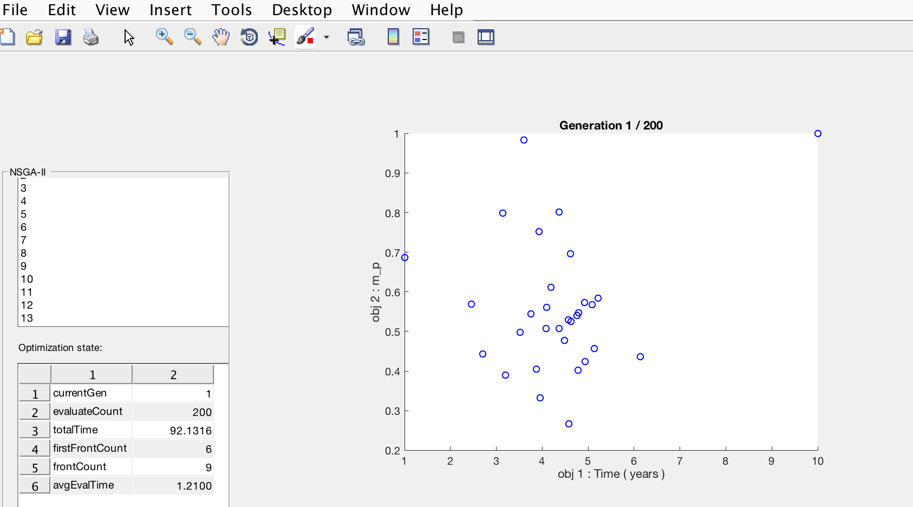

# MOLTO-IT
[](https://zenodo.org/badge/latestdoi/169291732)

**MOLTO-IT** (Multi-Objective Low-Thrust Optimizer for Interplanetary Trajectories) is a fully automated Matlab tool for the preliminary design of low-thrust, multi-gravity assist trajectories. The software combines an outer loop that provides multi-objective optimization via a genetic algorithm (NSGA-II) with an inner loop that supplies gradient-based optimization (fmincon) of a shape-based low-thrust trajectory parameterization. It includes simplifications such as coplanar bodies and no enforced propulsion constraints along with the shape-based parameterization of the low-thrust arc.

MOLTO-IT is designed to work with minimal user oversight. Users only need to input a series of parameters, such as the spacecraft’s departure body, its final destination and some hardware characteristics (Launcher vehicle, mass, propulsion), as well as the range of launch dates, flight times and a list of available planets to flyby. The software tool then uses these data points to automatically compute the set of low-thrust trajectories, including the number, sequence and configuration of flybys that accomplish the mission most efficiently. Candidate trajectories are evaluated and compared in terms of total flight time and propellant mass consumed. 

MOLTO-IT is easy to use and capable of designing a wide variety of missions on standard desktop computer.Computational times ranges from the order of minutes to a couple of hours, depending on the size of ther search spacee.

### Goal
The purpose of MOLTO-IT is to provide a fast and robust mission design environment that allows the user to quickly and inexpensively perform trade studies of various mission configurations and conduct low-fidelity analysis.

### Mathematical formulation
For a detailed mathematical description of the methodology, have a look at: 

David Morante, Manuel Sanjurjo Rivo, and Manuel Soler.  "Multi-Objective Low-Thrust Interplanetary Trajectory Optimization Based on Generalized Logarithmic Spirals", Journal of Guidance, Control, and Dynamics, Vol. 42, No. 3 (2019), pp. 476-490. 
https://doi.org/10.2514/1.G003702

## Installation Guide
Installation requires simply that you download [MOLTO-IT](https://github.com/uc3m-aerospace/MOLTO-IT/) and add the base directory to your Matlab path.

### Dependencies
A recent version of Matlab is needed to run the code (R2016a or newer). The [Matlab Optimization Toolbox](https://es.mathworks.com/help/optim/index.html) is required to use most of the functionality.

Download the Matlab interface of the [Spice Toolkit](https://naif.jpl.nasa.gov/naif/toolkit.html) for planets, comets and asteroids ephemerides calculations. Include the downloaded folders and subfolders in **MOLTO-IT/spice**. 

Download apropriate ephemerides [NAIF](https://naif.jpl.nasa.gov/pub/naif/generic_kernels/spk/) .bsp kernels. Include them in **MOLTO-IT/spice/kernels** 

**NOTE** Required kernels for running the example scenarios are already included in this distribution.

Modify the function **MOLTO-IT/spice/load_spice_kernels.m** to load the new kernels.

## Quick Usage Guide

In order to optimize a mission, the user needs to call the main function *molto_it.m* providing an input structure. Here you vae an example:

```matlab
% FLYBY MISSION TO JUPITER WITH UP TO 3 FLYBYS
        input.problem_name  = 'example'; % Problem name
        input.problem_type  = 'flyby'; % Type of mission: condition at arrival planet (flyby/rendezvous)
        input.planet_dep    = '3';     % Departure planet using space nomenclature (e.g. 3==Earth)
        input.planet_arr    = '5';     % Arrival planet using space nomenclature (e.g. 5==Jupiter)
        input.vinf0_max     =  2;      % Hyperbolic excess velocity at departure planet (km/s)
        input.planet_fb     = [{'4'},{'3'},{'2'}]; % List of available planets to flyby in spice nomenclature
        input.rfb_min       = 200;     % minimum flyby altitude (km)
        input.n_fb          = [0,3];   % minimum/maximum number of possible flybys
        input.rev           = [0,0];   % minimum/maximum number of possible revolutions
        input.ToF           = [50  50  50  50;  % minimum/maximum transfer time per leg (days)
                          500 500 500 1000];
        input.Initial_Date  = [{'2029 Jan 01 00:00:00'},{'2030 Dec 31 00:00:00'}]; % minimum/maximum Launch date (Gregorian Date)
        input.init_file     = [];      % Init population File name (if not provided, random initial population)
        input.output_file   = ['example','.txt']; % Solution population File name
        input.plot          = 0;       % plotting option (recomended = 0, option =1 is under development)
        input.useParallel   = 'yes';   % yes/no for parallel execution of the genetic algorithm
        input.maxGen        = 200;     % maximum number of generations
        input.popsize       = 200;     % Population Size
        input.spice_dir     =  '/home/MOLTO-IT/spice' % The spice directory folder
        
% RUN MOLTO-IT ALGORITHM
        molto_it(input)
```
**NOTE**: Ensure that all the folders and subfolders are in the matlab path.

The following window should pop-up, and the evolution process of the Pareto front can be visualized.




